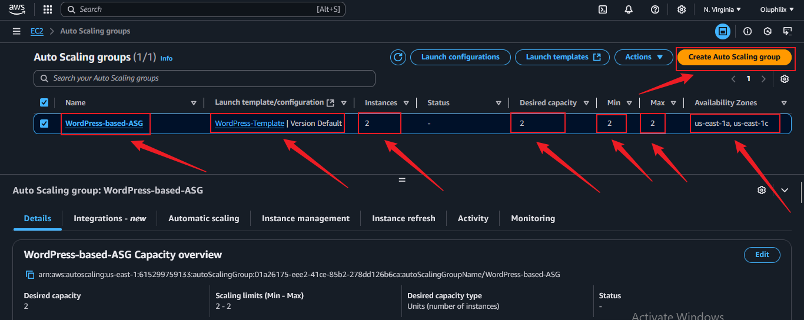

# Capstone Project: WordPress Site on AWS

### Project Scenario

A small to medium-sized digital marketing agency, __"DigitalBoost"__, wants to enhance its online presence by creating a high-performance. __WordPress-based__ website for their clients. The agency needs a scalable, secure, and cost-effective solution that can handle increasing traffic and seamlessly integrate with their existing infrastructure. Your task as an AWS Solutions Architect is to design and implement a WordPress solution using various AWS services, such as Networking, Compute, Object Storage, and Databases.

### Project Overview

The project overview with necessary architecture have been provided as you help __DigitalBoost__ with her Wordpress-Based Website. Kindly follow the instructions below to complete this Capstone Project. Also, necessary scripts have been provided here: 

### Project Deliverables

####  Documentation:
- Detailed documentation for each component setup.
- Explanation of security measures implemented.

####  Demonstration of the WordPress site.
- Demonstration of the WordPress site.
- Showcase auto-scaling by simulating increased traffic.

**Screenshot:** 


### Task 1: Development on Local Workstation

#### Step 1: Implement Version Control with Git

- Initialize Git Repository
- To begin, create the project directory named __WordPress-based__, navigate into it, and initialize it as a Git repository.

__Note__: For this project, I am using __Git Bash__ on a Windows workstation to execute these shell commands, as it provides a Unix-like command-line experience.

__Commands:__
```bash
mkdir WordPress-based
cd WordPress-based
git init
```

### Evaluation Report for the Capstone Project: WordPress Site on AWS


### Task 2: VPC Setup

#### VPC ARCHITECTURE

**Screenshot:** 


The **Virtual Private Cloud (VPC) Setup** is a critical component of the project, ensuring a secure and scalable environment for hosting the WordPress site. The following steps were performed:

#### Step 2.1: IP Address Range Definition
- Defined the CIDR block for the VPC to allocate private and public IP ranges.
- Ensured the CIDR block supports scalability and future growth needs.

**Screenshots:** 


- Showing VPC Name, VPC ID, IPv4 CIDR


#### Step 2.2: VPC Public and Private Subnet Creation
- Created the VPC with both public and private subnets to host resources securely.
- Configured the VPC for high availability and fault tolerance.

##### Public Subnets
1. **WordPress-Based-Public-subnet-1a**:
   - **CIDR Block**: `10.0.0.0/24`
   - **Availability Zone**: `us-east-1a`
   
   

2. **WordPress-Based-Public-subnet-1c**:
   - **CIDR Block**: `10.0.1.0/24`
   - **Availability Zone**: `us-east-1c`

**Screenshot:**  


##### Private Subnets
1. **WordPress-Based-Private-subnet-1a**:
   - **CIDR Block**: `10.0.2.0/24`
   - **Availability Zone**: `us-east-1a`
   
   

2. **WordPress-Based-Private-subnet-1c**:
   - **CIDR Block**: `10.0.3.0/24`
   - **Availability Zone**: `us-east-1c`

**Screenshot:**  


##### Notes
- Each subnet is designed to fit within the same VPC for seamless communication.
- Public subnets are configured to handle traffic from the internet, while private subnets are isolated for backend services.


#### Step 2.3: Internet Gateway and Route Table Configuration

To enable external connectivity for the public subnets, an Internet Gateway was created and attached to the VPC.

##### Internet Gateway Configuration
1. **Internet Gateway Name**: `WordPress-based-IGW`


2. **VPC**: `WordPress-based-VPC`

##### Internet Gateway Attachment

After creating the Internet Gateway, it was successfully attached to the VPC `WordPress-based-VPC`.

Below is a screenshot showing the attachment of the Internet Gateway to the VPC:

**Screenshot:**  


#### Route Table Configuration

With the Internet Gateway attached, route tables were configured for public and private subnets.

####  Public Subnet Route Table
##### Screenshot: WordPress-based Subnet Route Table
Below is screenshot of the public route table configurations:

**Public Subnet Route Table Name**: `WordPress-based-Public-RT`


- **Destination**: `0.0.0.0/0`
- **Target**: `WordPress-based-IGW`

**Screenshot:**  


- **Associated Subnets**:
  - `Public Subnet 1a`
  - `Public Subnet 1c`

**Screenshot:**  


#### Private Subnet Route Table
#### Screenshot: WordPress-based Subnet Route Table
Below is screenshot of the private route table configurations:

**Private Subnet Route Table Name**: `WordPress-based-Private-RT`

**Screenshot:**  


- Default configuration with no internet route.
- **Associated Subnets**:
  - `Private Subnet 1a`
  - `Private Subnet 1c`

**Screenshot:**  


### Task 3: Public and Private Subnet Configuration with NAT Gateway Setup

#### NAT GATEWAY ARCHITECTURE

**Screenshot:**  


#### 3.1: Public Subnet Setup
Proper setup of the public subnet for resources accessible from the Internet.  
- **Public Subnets**:
  - `Public-Subnet-1a (10.0.0.0/24)`
  - `Public-Subnet-1c (10.0.1.0/24)`

**Screenshot:** 


- **Internet Gateway**: 
  - Name: `WordPress-based-IGW`
  - Attached to: `WordPress-based-VPC`
  
**Screenshot:**  


- **Route Table Configuration**:
 - **Routes**:
   - `Destination`: `0.0.0.0/0`
   - **Target**: `WordPress-based-IGW`

**Screenshot:**  


#### Step 3.2: Private Subnet Setup 
Successful creation of the private subnet for resources with no direct Internet access.  
- **Private Subnets**:
  - `Private-Subnet-1a (10.0.2.0/24)`
  - `Private-Subnet-1c (10.0.3.0/24)`
  
**Screenshot:**  


- **Route Table Configuration**:
  - No direct route to the Internet.
  - Communication is through the NAT Gateway.

**Screenshot:** 


#### Step 3.3: NAT Gateway Configuration (10 Points):
Correct configuration of a NAT Gateway for private subnet Internet access.  
- **NAT Gateway Name**: `WordPress-based-NAT`
- **Public Subnet Used**: `Public-Subnet-1a (10.0.0.0/24)`
- **Elastic IP**: Allocated to NAT Gateway.

**Screenshots:** 


  - Showing NAT Gateway Name, NAT Gateway ID, NAT Gateway State.


### Task 4: AWS MySQL RDS Setup

#### Step 4.1: RDS Instance Creation
Proper creation of an Amazon RDS instance with the MySQL engine. Below is the screenshot of the created RDS instance.

**Screenshot:**  


#### 4.2: Security Group Configuration
Correct configuration of security groups for the RDS instance, ensuring proper inbound and outbound rules are set. Below is the screenshot of the security group configuration.

- Inbound rule configuration 

**Screenshots:**  


- Outbound rule configuration 


#### Step 4.3: WordPress-RDS Connection
Successful connection of WordPress to the RDS database, enabling seamless database interactions. Below is the screenshot of the connection setup.

**Screenshot:**  


### Task 5: Setting up Amazon EFS for WordPress

This guide outlines the steps to create and mount an Amazon EFS (Elastic File System) to be shared across WordPress instances. It also details how to configure WordPress to use the shared file system.

#### Step 5.1: Create an Amazon EFS File System

1. Navigate to the **Amazon EFS Console**.
2. Click on **Create File System**.
3. Configure the file system:
   - **Name**: `WordPress-based`
   - **VPC**: Select the VPC where your WordPress instances are running.
4. Leave the default options for performance and throughput.
5. Click **Create** to finish.

**Screenshots:**  


- Security Group Inbound rule


#### Step 5.2: Mount the EFS File System on WordPress Instances

- #### Install NFS Utilities
On each WordPress instance, install the required utilities for mounting the EFS file system:

__Commands:__
```bash
sudo yum update -y
sudo yum install -y amazon-efs-utils
```
**Screenshot:**  


- #### Create a Mount Point
Create a directory to serve as the mount point for the EFS:

__Command:__
```bash
sudo mkdir -p /mnt/efs
```
**Screenshot:**  


- #### Mount the EFS File System
Mount the EFS file system using its DNS name (replace `<EFS-ID>` with your actual EFS ID):

__Command:__
```bash
sudo mount -t efs -o tls fs-0a50bb60595fc972d /mnt/efs
```

**Screenshot:**  


- #### Verify the Mount
To ensure the EFS file system is mounted, run:

__Command:__
```bash
df -h
```

You should see the EFS file system in the output.

**Screenshot:**  


- #### Persist the Mount on Reboots
Add the EFS entry to the `/etc/fstab` file:

__Commands:__
```bash
echo "fs-0a50bb60595fc972d /mnt/efs efs defaults,_netdev 0 0" | sudo tee -a /etc/fstab
```
**Screenshot:**  


### Step 5.3: Configure WordPress to Use the Shared File System

### Move WordPress Files to EFS

1. Stop the Apache web server:

__Command:__
```bash
sudo systemctl stop httpd
```

1. Copy the WordPress files to the EFS mount:

__Command:__
```bash
sudo cp -r /var/www/html/* /mnt/efs/
```

2. Update the `/var/www/html` directory to point to the EFS mount:

__Commands:__
```bash
sudo rm -rf /var/www/html
sudo ln -s /mnt/efs /var/www/html
```

3. Restart the Apache web server:

__Commands:__
```bash
sudo systemctl start httpd
```
**Screenshot:**  


#### Verify the Setup

Visit your WordPress site in the browser to ensure it is functioning correctly. All WordPress instances will now share the same EFS storage.

**Screenshot:**  


### Task 6: Application Load Balancer Setup

#### Objective
Set up an Application Load Balancer to distribute incoming traffic among multiple instances, ensuring high availability and fault tolerance.


#### Step 6.1 : Create an Application Load Balancer
- Navigate to the EC2 dashboard.
- Under **Load Balancers**, click on **Create Load Balancer**.
- Choose **Application Load Balancer**.
- Configure:
  - **Name**: `WordPress-based`
  - **Scheme**: `Internet-facing`
  - **IP address type**: `IPv4`
  - Select **VPC** and **Subnets** for high availability.
- Add listeners (HTTP/HTTPS).
- Click **Next** to proceed to security groups.
- Add security group rules to allow inbound traffic (HTTP: 80, HTTPS: 443).

**Screenshots:**  


- Security Group Inbound rule
  


#### Step 6.2 : Configure Listener Rules
- In the **Listeners** tab, define routing rules.
- Create a target group:
  - **Target Group Name**: `WordPress-based-TG`
  - **Target type**: `Instance`
  - **Protocol**: `HTTP` or `HTTPS`
  - **VPC**: `WordPress-based-VPC`
- Register EC2 instances (e.g., public/private) with the target group.
- Test routing to ensure traffic reaches the appropriate instance.

**Screenshot:**  


#### Step 6.3 : Integrate Load Balancer with Auto Scaling Group
- Navigate to the **Auto Scaling Groups** section in EC2.
- Create a new Auto Scaling Group or modify an existing one.
- Associate the Application Load Balancer’s target group with the Auto Scaling Group.
- Configure scaling policies based on load or performance metrics.
- Review and save the configuration.

**Screenshot:**  


#### Testing the Load Balancer
- Access the Load Balancer DNS name (available in the EC2 dashboard under Load Balancers).
- Verify traffic distribution across instances by refreshing the browser or using tools like **curl**.

**Screenshot 1:** 

- Access the Load Balancer DNS name 


**Screenshot 2:** 


**Screenshot 3:** 


- Curl localhost


### Task 7 : Auto Scaling Group

#### Objective
Implement Auto Scaling to automatically adjust the number of instances based on traffic load.

#### Step 7.1: Create an Auto Scaling Group
   - Navigate to **EC2 Dashboard** > **Auto Scaling Groups** > **Create Auto Scaling Group**.
   - Name your Auto Scaling Group : `WordPress-based-ASG`
   - Select the **Launch Template** or **Launch Configuration** for your instances.

**Screenshot:**  



#### Step 7.2: Define Scaling Policies
   - Set the following capacities:
    - **Desired Capacity**: The number of instances you want running under normal conditions.
    - **Minimum Capacity**: The lowest number of instances to maintain.
    - **Maximum Capacity**: The maximum number of instances to scale up to.

**Screenshot:**  


#### Step 7.3: Configure Load Balancer Integration
   - Under **Load Balancing**, attach the previously created **Target Group**.
   - Ensure the Auto Scaling Group routes traffic to the **Application Load Balancer (ALB)**.


 **Test the Auto Scaling Group**:

   - Simulate traffic load on the ALB to trigger Auto Scaling.
   - Verify the creation or termination of instances based on the defined scaling policies.

**Screenshots:**


### Task 8: Project Documentation: Staging, Committing, and Pushing Code to GitHub

#### Step 8:1 Stage and Commit the Template to Git

In this step, I will add the website files to the Git repository, configure my global Git settings, and make an initial commit with a descriptive message.

- Add Files: Add all website files to the staging area.

- Configure Git User Information: Set up global configuration with my actual git username and email address.

- Commit Changes: Commit the changes with a clear and descriptive message.

```bash
git add .
git config --global user.name "YourUsername"
git config --global user.email "youremail@example.com"
git commit -m "Initial commit: Add WordPress site template files"
```

#### Step 8.2: Push the code to your Github repository

After initializing your Git repository and adding your WordPress site template, the next step is to push your code to a remote repository on GitHub. This step is crucial for version control and collaboration.

- Create a Remote Repository on GitHub: Log into your GitHub account and create a new repository named __WordPress-based__. Leave the repository empty without initializing it with a README, .gitignore, or license.


- Link Your Local Repository to GitHub: In your terminal, within your project directory, add the remote repository URL to your local repository configuration.

- Push Your Code: Upload Your Local Repository Content to GitHub Once you have linked your local repository to GitHub, use the following command to push your commits from your local main branch to the remote repository. This enables you to store your project in the cloud and share it with others.